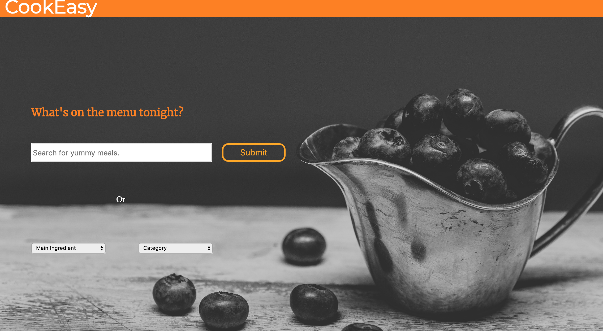
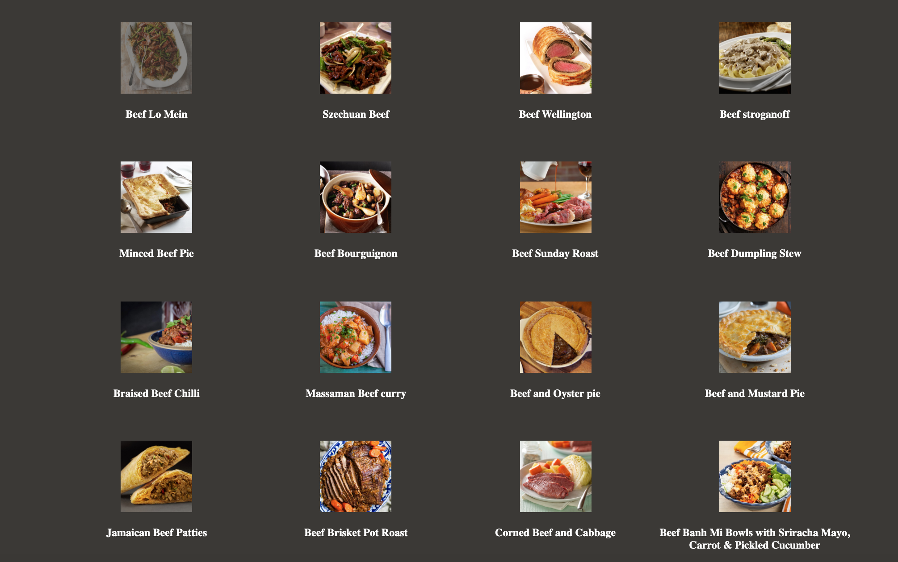
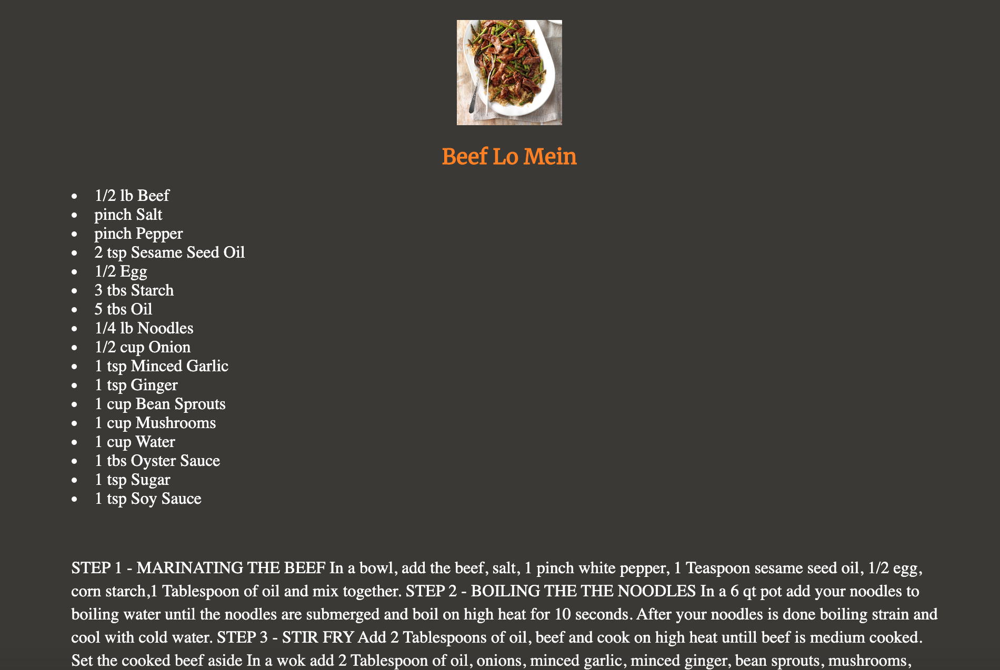

CookEasy
========
* * *

Summary
-------

An application with an archive of recipes. Users can search up specific recipes, browse through recipes by main ingredient, or browse through recipes by cuisine type.

[CookEasy Link](https://jennantran.github.io/CookEasy/)

* * *

Screenshots
-----------

Landing Page:

List of Recipes:

Selected Recipe Page:

* * *

Technologies Used
-----------------
1. JavaScript
2. HTML
3. CSS
4. JQuery
